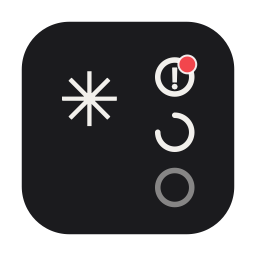
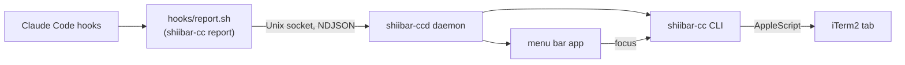

# Shiibar CC



A macOS menu bar app + CLI that watches your Claude Code agent sessions
running in iTerm2 and lets you jump straight to the right one.

**iTerm2 only, by design.** Sessions running in any other terminal
(Terminal.app, VS Code's integrated terminal, SSH) are not tracked at all —
they never appear in the list, and there is nothing to jump to. If your
Claude Code sessions don't live in iTerm2, this tool does nothing for you.

## What it does

Claude Code hooks report each session's state to a small local daemon, which
a menu bar app and a CLI both subscribe to. The tray icon shows a
roll-up of every session at a glance:

- **working** — an agent is actively running a tool or generating a response
- **waiting** — an agent is blocked on you (a permission prompt, a question)
- **idle** — an agent has nothing pending (just started, or finished its work)
- **unreviewed** — a badge that stays lit until you've actually looked at a
  session that finished or started waiting

Click a session in the dropdown (or a notification) and it jumps to that
session's iTerm2 tab.

<!-- TODO: screenshot -->

## Permissions

Installing and running Shiibar CC asks for the following. Each one maps to a
specific feature — nothing is requested speculatively.

- **Automation (Apple Events) for iTerm2**: needed to find and select the
  right window/tab/session when you jump to an agent. This is the only
  terminal app Shiibar CC drives.
- **Notifications**: needed to alert you when a session starts waiting on
  you, or finishes.
- **Login Items**: the app registers itself to start at login automatically
  the first time you launch it. You can turn this off any time from the
  app's `⌄` menu (Settings → Start at Login); once you do, the app respects
  that choice and won't re-register itself.
- **A self-signed certificate in your keychain**: the app is signed locally
  with a stable identity created on first install (`security` /
  `codesign`), so that rebuilding it doesn't reset the notification
  permission macOS ties to the app's signature.
- **Hooks added to `~/.claude/settings.json`**: Shiibar CC needs Claude Code
  to report session events to it. The installer **never edits this file
  automatically** — it prints a JSON snippet and you merge it in yourself,
  so your existing hooks and config are never at risk of being clobbered.
- **A state directory** (`~/.local/state/shiibar-cc/`): holds the daemon's
  Unix socket, its persisted session state, and its log file. Nothing here
  leaves your machine.

## Install / Uninstall

**Requirements**: macOS 13 or later, a Rust toolchain via
[rustup](https://rustup.rs) (the pinned version in `rust-toolchain.toml` is
installed automatically), and Xcode Command Line Tools for building the app
(`swift build`). Running the app's own test suite (`swift test`, not
required for normal use) needs the full Xcode.app, not just the CLT.

```sh
git clone <this repo>
cd shiibar-cc
./scripts/install.sh
```

This builds the daemon and CLI, builds and bundles the menu bar app as
`ShiibarCC.app` (installed to `~/Applications` by default), code-signs it,
symlinks `shiibar-cc` / `shiibar-ccd` onto `~/.local/bin`, installs
`hooks/report.sh`, and launches the app once (which registers it as a Login
Item and starts the daemon). It then prints the hooks snippet to merge into
`~/.claude/settings.json` by hand, and points you at `shiibar-cc doctor` to
verify everything end to end.

To remove it:

```sh
./scripts/uninstall.sh          # quits the app, removes the app bundle,
                                 # Login Item, and ~/.local/bin symlinks —
                                 # settings.json hooks and state are left in
                                 # place, so reinstalling is quick
./scripts/uninstall.sh --purge  # also removes the hooks block from
                                 # ~/.claude/settings.json (backed up first),
                                 # the state directory, the app's saved
                                 # preferences, the local signing
                                 # certificate, and the iTerm2 Automation
                                 # grant
```

Either way, the notification permission itself can't be removed by a
script — macOS ties it to the app, and only System Settings → Notifications
can revoke it.

## How it works



- Every Claude Code hook event runs `hooks/report.sh`, which shells out to
  `shiibar-cc report` to forward it to the daemon (`shiibar-ccd`) over a
  Unix domain socket.
- The daemon holds all session state in memory (and persists it to
  `~/.local/state/shiibar-cc/state.json`) and pushes changes to every
  connected subscriber — the menu bar app and any CLI client using
  `shiibar-cc watch`/`wait`.
- Jumping to a session ("focus") drives iTerm2 with AppleScript. iTerm2 is
  the only terminal app Shiibar CC knows how to control, by design.
- If a session's state ever drifts (a hook was missed, a pane was closed),
  the app self-repairs by reconciling against `claude agents` — on launch,
  on daemon reconnect, and on demand via the dropdown's Rescan action.
- All local state — the daemon's socket, its persisted session state, and
  its log — lives under `~/.local/state/shiibar-cc/`.

### CLI

```
shiibar-cc report <event>    # hooks-only: reads a hook payload from stdin and forwards it to the daemon
shiibar-cc list [--json]     # current agents: status, label, elapsed time, target
shiibar-cc wait <selector>   # block until a session reaches a given status
shiibar-cc watch             # stream state-change events as line-delimited JSON
shiibar-cc focus <selector>  # jump to a session's iTerm2 tab
shiibar-cc focused           # print the target of the frontmost iTerm2 session, if any
shiibar-cc reconcile         # self-repair: sync state against `claude agents`
shiibar-cc remove <selector> # manually remove a stale entry
shiibar-cc doctor [--json]   # diagnose the install (socket, hooks config, PATH, Automation permission)
```
