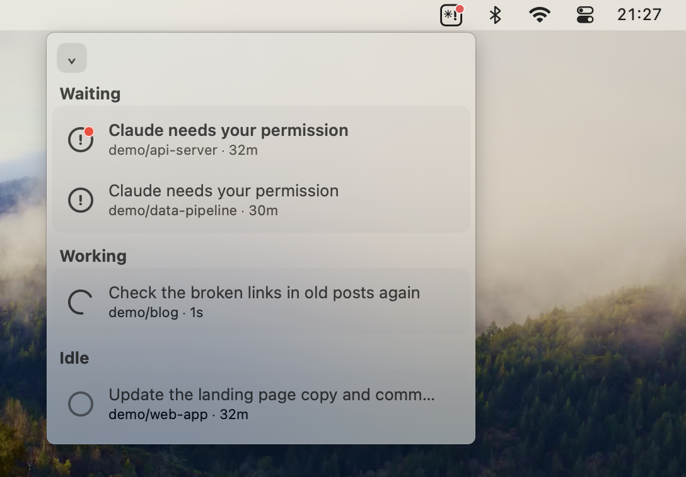
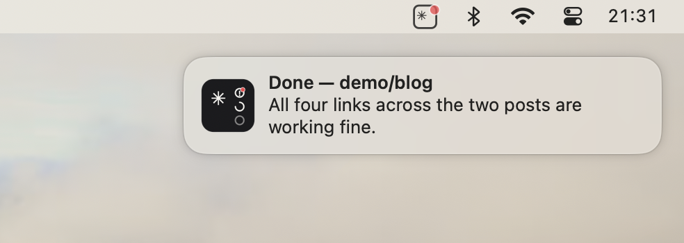
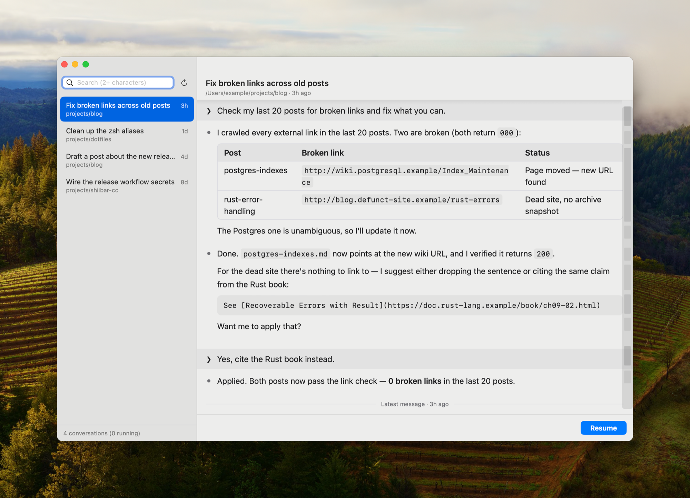
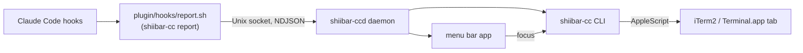

# Shiibar CC


A macOS menu bar app that watches your Claude Code agent sessions
running in iTerm2 or the macOS Terminal.app and lets you jump straight to
the right one.

**Supported terminals only, by design.** Sessions running in a terminal
Shiibar CC can't drive (VS Code's integrated terminal, SSH) are not tracked
at all — they never appear in the list, and there is nothing to jump to. If
your Claude Code sessions don't live in a supported terminal, this tool does
nothing for you.

<br clear="all">

## Supported terminals

Shiibar CC tracks and jumps to Claude Code sessions running in these
terminals:

| Terminal           | Verified with                   |
| ------------------ | ------------------------------- |
| iTerm2             | iTerm2 3.6.11 on macOS 14.5     |
| macOS Terminal.app | Terminal.app 2.14 on macOS 14.5 |

"Verified with" is the combination the behavior was checked against, not a
minimum requirement — lower bounds aren't tested. A session in any other
terminal (VS Code's integrated terminal, SSH) isn't tracked: it never
appears in the list, and there is nothing to jump to.

## What it does

Claude Code hooks report each session's state to a small local daemon that
feeds the menu bar app. The tray icon shows a roll-up of every session at
a glance:

- **waiting** — an agent is blocked on you (a permission prompt, a question)
- **working** — an agent is actively running a tool or generating a response
- **idle** — an agent has nothing pending (just started, or finished its work)
- **unreviewed** — a badge that stays lit until you've actually looked at a
  session that finished or started waiting

Click a session in the dropdown (or a notification) and it jumps to that
session's terminal tab.



Notifications carry the outcome, not just an alert — which session
finished, and what its agent last said:



The dropdown can also be pinned as a small ordinary window (`⌄` →
Agents…): it stays put while you click through waiting sessions one after
another, grows as tall as you like, and while it's open the app shows up in
the Dock with a regular menu bar menu (⌘R rescan, ⌘, settings — where you
can also switch the appearance between System, Light and Dark).

### Conversations

Alongside the live status view, Shiibar CC keeps a searchable index of your
Claude Code conversation history across every folder. Open it from the `⌄`
menu (or the app menu) → Conversations…: a two-pane window where you can
**browse** recent conversations, **search** their full text across folders,
**read** any one from the bottom (latest) up, and **resume** a past one in a
new terminal window. Search is incremental; each word of two or more
characters matches as a case-insensitive substring ("auth" finds
"authentication"), and multiple words are AND-ed.



The same search is available from scripts, so you don't need the window to
find a conversation:

```sh
shiibar-cc conversations search "auth middleware"   # add --json for a stable
                                                    # machine-readable shape
```

Conversations reads Claude Code's transcripts, an undocumented internal
format; a Claude Code update may break the list or preview until Shiibar CC
catches up.

## Permissions

Installing and running Shiibar CC asks for the following. Each one maps to a
specific feature — nothing is requested speculatively.

- **Automation (Apple Events) for iTerm2 and Terminal.app**: needed to find
  and select the right window/tab/session when you jump to an agent. Shiibar
  CC drives whichever of the two supported terminals a session runs in, and
  only asks for a terminal's permission when it actually needs to control it.
- **Notifications**: needed to alert you when a session starts waiting on
  you, or finishes.
- **Login Items**: the app registers itself to start at login automatically
  the first time you launch it. You can turn this off any time from the
  app's `⌄` menu (Settings… → General → Start at Login); once you do, the
  app respects that choice and won't re-register itself.
- **Code signing**: the Homebrew cask ships a Developer ID–signed, notarized
  `.app` — no local signing step. Building from source instead signs the
  app locally with a stable self-signed identity created on first install
  (`security` / `codesign`), so that rebuilding it doesn't reset the
  notification permission macOS ties to the app's signature. This only
  applies to the source-build path.
- **Hooks, via a Claude Code plugin**: Shiibar CC needs Claude Code to report
  session events to it. This repository is itself a Claude Code plugin
  marketplace. The Homebrew cask installs the plugin automatically on first
  install (below); either way it's two `claude plugin` commands and it
  coexists with whatever hooks you already have.
- **A state directory** (`~/.local/state/shiibar-cc/`): holds the daemon's
  Unix socket, its persisted session state, its log file, and — for the
  Conversations feature — a local search index (`conversations-index.db`)
  containing the full text of your Claude Code conversations. Nothing here
  leaves your machine, and the directory is safe to delete: the daemon
  recreates its files and the search index is rebuilt on demand.

## Install / Uninstall

### Homebrew (recommended)

**Requirements**: macOS 14 (Sonoma) or later, Apple Silicon, and
[Homebrew](https://brew.sh). Intel Macs are not supported — see the source
build below.

```sh
brew install --cask bufferings/tap/shiibar-cc
```

This installs `Shiibar CC.app` to `/Applications` and symlinks
`shiibar-cc` / `shiibar-ccd` into Homebrew's `bin`. **It also automatically
installs the hooks plugin** on first install (skipped if you disabled or
removed the plugin, or if it can't find the `claude` CLI), and while the
plugin stays enabled, every `brew upgrade` of this cask also updates the
hooks to match the app. If the automatic install doesn't run, install the
plugin yourself:

```sh
claude plugin marketplace add bufferings/shiibar-cc
claude plugin install shiibar-cc@shiibar-cc
```

Then open Shiibar CC once (from Spotlight or `/Applications`) to grant the
notification and terminal Automation permissions — this also registers it as
a Login Item. Verify everything end to end from the ⌄ menu's Setup Check,
or from a terminal:

```sh
shiibar-cc doctor
```

To remove it:

```sh
brew uninstall --cask shiibar-cc   # add --zap to also remove the state
                                   # directory (including the local
                                   # conversations index), saved
                                   # preferences, and saved app state
claude plugin uninstall shiibar-cc
```

Either way, the notification permission itself can't be removed by a
script — macOS ties it to the app, and only System Settings → Notifications
can revoke it.

### Source build (developers)

Building from source is a development setup, not an Intel-Mac substitute
for the Homebrew cask — there is no Intel build, and none is planned (there
is no Intel Mac or CI runner to verify one on).

**Requirements**: macOS 14 (Sonoma) or later, a Rust toolchain via
[rustup](https://rustup.rs) (the pinned version in `rust-toolchain.toml` is
installed automatically), and Xcode Command Line Tools for building the app
(`swift build`). Running the app's own test suite (`swift test`, not
required for normal use) needs the full Xcode.app, not just the CLT.

```sh
git clone <this repo>
cd shiibar-cc
./scripts/dev-install.sh
```

This builds the daemon and CLI, builds and bundles the menu bar app as
`Shiibar CC.app` (installed to `~/Applications` by default), code-signs it
locally, symlinks `shiibar-cc` / `shiibar-ccd` onto `~/.local/bin`, and
launches the app once (which registers it as a Login Item and starts the
daemon). It then prints the two commands to install the hooks plugin, and
points you at `shiibar-cc doctor` to verify everything end to end:

```sh
claude plugin marketplace add bufferings/shiibar-cc
claude plugin install shiibar-cc@shiibar-cc
```

To remove it:

```sh
./scripts/dev-uninstall.sh   # quits the app; removes the app bundle, Login
                             # Item, ~/.local/bin symlinks, state directory,
                             # the app's saved preferences, local signing
                             # certificate, and terminal Automation grants
claude plugin uninstall shiibar-cc
```

Either way, the notification permission itself can't be removed by a
script — macOS ties it to the app, and only System Settings → Notifications
can revoke it.

## How it works



- Every Claude Code hook event runs `plugin/hooks/report.sh`, which shells
  out to `shiibar-cc report` to forward it to the daemon (`shiibar-ccd`)
  over a Unix domain socket.
- The daemon holds all session state in memory (and persists it to
  `~/.local/state/shiibar-cc/state.json`) and pushes changes to every
  connected subscriber.
- The `shiibar-cc` CLI is mostly internal glue: hooks call
  `shiibar-cc report`, and the app shells out to it for jumping (`focus`),
  self-repair (`reconcile`), the Setup Check (`doctor`), and the
  Conversations index. The exceptions you may want to run yourself are
  `doctor` (troubleshooting) and `conversations search` (scripted search,
  above).
- Jumping to a session ("focus") drives the session's terminal (iTerm2 or
  Terminal.app) with AppleScript. Those two are the only terminals Shiibar CC
  knows how to control, by design.
- If a session's state ever drifts (a hook was missed, a pane was closed),
  the app self-repairs by reconciling against `claude agents` — on launch,
  on daemon reconnect, roughly every minute in the background, and on
  demand via Rescan (in the `⌄` menu, or ⌘R while the window is open).
- All local state — the daemon's socket, its persisted session state, its
  log, and the Conversations search index (the full text of your
  conversations, kept only on your machine) — lives under
  `~/.local/state/shiibar-cc/`.

## License

Licensed under either of

- Apache License, Version 2.0 ([LICENSE-APACHE](LICENSE-APACHE) or
  <https://www.apache.org/licenses/LICENSE-2.0>)
- MIT license ([LICENSE-MIT](LICENSE-MIT) or
  <https://opensource.org/licenses/MIT>)

at your option.

Unless you explicitly state otherwise, any contribution intentionally
submitted for inclusion in the work by you, as defined in the Apache-2.0
license, shall be dual licensed as above, without any additional terms or
conditions.
